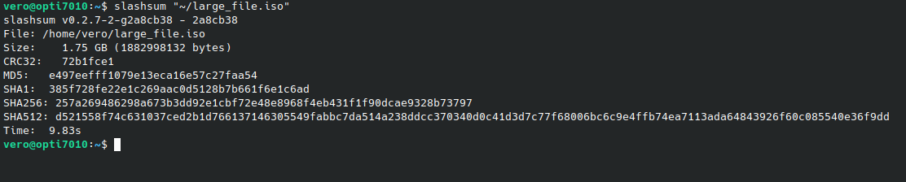

# Slashsum 🔍

**Multi-threaded file checksum calculator**

[](https://github.com/NDXDeveloper/slashsum/actions/workflows/ci.yml)
[](https://github.com/NDXDeveloper/slashsum/releases)
[](https://snapcraft.io/slashsum)
[]()
[](LICENSE)

⚡ Calculate multiple file checksums simultaneously with blazing-fast performance using Rust's concurrency capabilities.

---

## 📑 Table of Contents

- [🚀 Quick Start](#-quick-start)
- [✨ Features](#-features)
- [📸 Screenshot](#-screenshot)
- [📦 Installation](#-installation)
- [🛠️ Usage](#-usage)
- [📈 Performance Benchmarks](#-performance-benchmarks)
- [⚖️ Comparison with Alternatives](#-comparison-with-alternatives)
- [🧠 How It Works](#-how-it-works)
- [🔧 Technical Details](#-technical-details)
- [❓ FAQ](#-faq)
- [🗑️ Uninstall](#-uninstall)
- [📚 Dependencies](#-dependencies)
- [🤝 Contributing](#-contributing)
- [📋 Changelog](#-changelog)
- [👤 Author](#-author)
- [📜 License](#-license)

---

## 🚀 Quick Start

```bash
# Linux (Snap Store - recommended)
sudo snap install slashsum

# Linux (Debian/Ubuntu)
sudo apt install ./slashsum_v*_amd64.deb

# Windows (download installer from releases page)
# Run slashsum-setup-user-v*.exe

# Calculate checksums
slashsum myfile.iso

# Save results to file
slashsum myfile.iso --save
```

---

## ✨ Features

- ⚡ **Parallel computation** of 5 hash algorithms simultaneously
- 📊 **Supported algorithms**:
  - CRC32 (IEEE 802.3)
  - MD5
  - SHA-1
  - SHA-256
  - SHA-512
- 📁 **Large file support** (>10GB tested)
- 💾 **Save results** to `.checksum` files
- ⏱️ **Execution time metrics**
- 🖥️ **Cross-platform** (Windows/Linux/macOS)
- 🎯 **Zero configuration** - works out of the box
- 🪶 **Lightweight** - single binary, no dependencies

---

## 📸 Screenshot



---

## 📦 Installation

### Option 1: Linux (Snap Store) - Recommended ⭐

```bash
sudo snap install slashsum
```

🔄 Auto-updates enabled. [View on Snap Store](https://snapcraft.io/slashsum)

### Option 2: 🐧 Linux (Portable)

Download the portable package from the [releases page](https://github.com/NDXDeveloper/slashsum/releases):

```bash
tar -xzvf slashsum-linux-amd64-portable.tar.gz
cd slashsum-linux-amd64-portable
sudo ./install.sh
```

### Option 3: 🐧 Linux (DEB - Debian/Ubuntu/Linux Mint)

Download the `.deb` file from the [releases page](https://github.com/NDXDeveloper/slashsum/releases):

```bash
sudo apt install ./slashsum_<version>_amd64.deb
```

### Option 4: 🐧 Linux (Snap from GitHub Release)

```bash
sudo snap install --dangerous slashsum_<version>_amd64.snap
```

### Option 5: 🪟 Windows (Installer) - Recommended ⭐

Download the installer from the [releases page](https://github.com/NDXDeveloper/slashsum/releases):

| Installer | Description | Admin Required |
|-----------|-------------|----------------|
| `slashsum-setup-user-<version>.exe` | 👤 Current user only | No |
| `slashsum-setup-admin-<version>.exe` | 🔐 System-wide | Yes |

### Option 6: 🪟 Windows (Portable)

Download `slashsum-windows-amd64-portable.zip` from the [releases page](https://github.com/NDXDeveloper/slashsum/releases):

```powershell
Expand-Archive slashsum-windows-amd64-portable.zip -DestinationPath .
cd slashsum-windows-amd64-portable
.\install.bat
```

### Option 7: 🍎 macOS (Portable)

Download the portable package from the [releases page](https://github.com/NDXDeveloper/slashsum/releases):

```bash
tar -xzvf slashsum-darwin-amd64-portable.tar.gz
cd slashsum-darwin-amd64-portable
sudo ./install.sh
```

### Option 8: 🔨 Build from source

**Prerequisites**: [Rust toolchain](https://rustup.rs) (1.70+)

```bash
git clone https://github.com/NDXDeveloper/slashsum
cd slashsum
cargo build --release
```

The binary will be available at `target/release/slashsum`.

---

## 🛠️ Usage

### Basic Syntax

```bash
slashsum <FILE> [OPTIONS]
```

### Options

| Option | Description |
|--------|-------------|
| `--save` | Save checksums to a `.checksum` file |
| `-h`, `--help` | Print help information |
| `--version` | Print version and license information |

### Examples

```bash
# Calculate checksums for a file
slashsum document.pdf

# Calculate and save results
slashsum large_file.iso --save
# Creates: large_file.iso.checksum

# Display help
slashsum --help

# Display version and license
slashsum --version

# Process multiple files (shell loop)
for f in *.iso; do slashsum "$f" --save; done
```

### Output Format

```
File:     large_file.iso
Size:     4.68 GB (5033165312 bytes)
CRC32:    8d7be4e9
MD5:      a3b9d148c5f8d237f735a5d9795a2345
SHA1:     2aae6c35c94fcfb415dbe95f408b9ce91ee846ed
SHA256:   b94d27b9934d3e08a52e52d7da7dabfac484efe37a5380ee9088f7ace2efcde9
SHA512:   309ecc489c12d6eb4cc40f50c902f2b4d0ed77ee511a7c7a9bcd3ca86d4cd86f989dd35bc5ff499670da34255b45b0cfd830e81f605dcf7dc5542e93ae9cd76f
Time:     12.45s
```

---

## 📈 Performance Benchmarks

### 🖥️ Test Environment

- **CPU**: AWS EC2 t2.xlarge (4 vCPUs)
- **RAM**: 16GB
- **Storage**: EBS SSD (gp3)
- **OS**: Ubuntu 22.04 LTS

### 📊 Results

| File Size | Slashsum | sha256sum | md5sum | Improvement |
|-----------|----------|-----------|--------|-------------|
| 100 MB    | 0.45s    | 0.28s     | 0.15s  | 5 hashes in ~1x time |
| 1 GB      | 2.34s    | 2.10s     | 1.20s  | 5 hashes in ~1x time |
| 10 GB     | 25.12s   | 22.50s    | 12.80s | 5 hashes in ~1x time |
| 50 GB     | 128.70s  | 115.00s   | 65.00s | 5 hashes in ~1x time |

> 💡 **Key insight**: Slashsum calculates **5 different checksums** in approximately the same time it takes traditional tools to calculate just **1 checksum**. This is because the bottleneck is disk I/O, not CPU.

### 🚀 Throughput

| Storage Type | Read Speed | Slashsum Throughput |
|--------------|------------|---------------------|
| HDD (7200rpm)| ~150 MB/s  | ~150 MB/s          |
| SSD (SATA)   | ~550 MB/s  | ~500 MB/s          |
| NVMe SSD     | ~3500 MB/s | ~2000 MB/s         |

---

## ⚖️ Comparison with Alternatives

| Feature | Slashsum | sha256sum | md5sum | hashdeep |
|---------|----------|-----------|--------|----------|
| CRC32 | Yes | No | No | No |
| MD5 | Yes | No | Yes | Yes |
| SHA-1 | Yes | No | No | Yes |
| SHA-256 | Yes | Yes | No | Yes |
| SHA-512 | Yes | No | No | No |
| **All 5 at once** | **Yes** | No | No | No |
| Parallel processing | Yes | No | No | Yes |
| Single binary | Yes | Yes | Yes | Yes |
| Cross-platform | Yes | Linux/macOS | Linux/macOS | Yes |
| Progress indicator | No | No | No | Yes |
| Recursive scan | No | No | No | Yes |

### ✅ When to use Slashsum

- You need **multiple checksums** for the same file
- You want to **verify file integrity** with redundancy
- You're creating **release artifacts** that need multiple hashes
- You want **one command** instead of running 5 tools

### ⚠️ When to use alternatives

- You only need **one specific hash**
- You need to **recursively scan directories** (use `hashdeep`)
- You need a **progress bar** for very large files

---

## 🧠 How It Works

```
┌─────────────────────────────────────────────────────────────────┐
│                         SLASHSUM                                │
├─────────────────────────────────────────────────────────────────┤
│                                                                 │
│   ┌─────────┐    ┌──────────────┐    ┌─────────────────────┐   │
│   │  File   │───>│   Reader     │───>│  Crossbeam Channel  │   │
│   │ (disk)  │    │ (1MB chunks) │    │   (broadcaster)     │   │
│   └─────────┘    └──────────────┘    └──────────┬──────────┘   │
│                                                  │              │
│                    ┌─────────────────────────────┼───────┐      │
│                    │                             │       │      │
│                    v                             v       v      │
│              ┌──────────┐  ┌──────────┐  ┌──────────┐   ...    │
│              │  CRC32   │  │   MD5    │  │  SHA-1   │          │
│              │ (thread) │  │ (thread) │  │ (thread) │          │
│              └────┬─────┘  └────┬─────┘  └────┬─────┘          │
│                   │             │             │                 │
│                   v             v             v                 │
│              ┌─────────────────────────────────────────────┐   │
│              │            Result Aggregator                │   │
│              └─────────────────────────────────────────────┘   │
│                                    │                            │
│                                    v                            │
│                             ┌────────────┐                      │
│                             │   Output   │                      │
│                             └────────────┘                      │
│                                                                 │
└─────────────────────────────────────────────────────────────────┘
```

### ⚙️ Processing Steps

1. 📖 **File Reading**: Buffered reading in 1MB chunks for optimal I/O
2. 📡 **Data Distribution**: Uses crossbeam channels to broadcast chunks to all hash workers
3. ⚡ **Parallel Processing**: Dedicated thread for each hash algorithm (5 threads)
4. 🔗 **Result Aggregation**: Waits for all threads to complete and collects results
5. 📝 **Output Formatting**: Human-readable sizes and standardized hash formats

### 🤔 Why 1MB chunks?

- ❌ **Too small** (4KB): High overhead from channel operations
- ❌ **Too large** (100MB): High memory usage, cache misses
- ✅ **1MB**: Sweet spot balancing throughput and memory efficiency

---

## 🔧 Technical Details

| Property | Value |
|----------|-------|
| **Binary size** | ~650 KB (Linux), ~700 KB (Windows) |
| **Memory usage** | ~10-15 MB (5 threads × 1MB buffer + overhead) |
| **Rust version** | 1.70+ (stable) |
| **Architecture** | x86_64 only |
| **Dependencies** | None (static binary) |
| **Threads** | 5 (one per hash algorithm) + 1 (file reader) |
| **Buffer size** | 1 MB per chunk |
| **Channel capacity** | 1024 chunks |

### 🖥️ Supported Platforms

| Platform | Architecture | Format |
|----------|--------------|--------|
| 🐧 Linux | x86_64 | Binary, DEB, Snap, tar.gz |
| 🪟 Windows | x86_64 | EXE installer, ZIP portable |
| 🍎 macOS | x86_64 | tar.gz portable |

---

## ❓ FAQ

### 🤔 Why calculate 5 checksums instead of just one?

Different use cases require different algorithms:
- **CRC32**: Fast error detection, used in ZIP files
- **MD5**: Legacy compatibility, still widely used
- **SHA-1**: Git commits, some package managers
- **SHA-256**: Modern standard, security applications
- **SHA-512**: Maximum security, large file verification

Having all 5 ready saves time when you need to publish or verify files.

### 🚀 Why is Slashsum not much slower than single-hash tools?

Disk I/O is the bottleneck, not CPU. While reading the file once, all 5 hash algorithms process the data in parallel. The overhead of parallel processing is minimal compared to disk read time.

### 🎛️ Can I choose which algorithms to calculate?

Not currently. Slashsum always calculates all 5 checksums. This keeps the tool simple and ensures consistent output. Future versions may add algorithm selection.

### ✅ Does Slashsum verify checksums?

Not yet. Currently, Slashsum only calculates checksums. Verification mode (`--verify`) may be added in future versions.

### 💻 Why x86_64 only?

Cross-compilation for ARM and other architectures is planned but not yet implemented. You can build from source for other architectures if you have Rust installed.

### 🔒 Is it safe to use MD5/SHA-1?

For **file integrity** (detecting accidental corruption): ✅ Yes, they're fine.
For **security** (detecting tampering): ⚠️ Use SHA-256 or SHA-512.

Slashsum provides both, so you can use the appropriate one for your needs.

---

## 🗑️ Uninstall

### 🐧 Linux (Snap)

```bash
sudo snap remove slashsum
```

### 🐧 Linux (DEB)

```bash
sudo apt remove slashsum
```

### 🐧🍎 Linux/macOS (Portable)

```bash
# Using uninstall script
sudo ./uninstall.sh

# Or manually
sudo rm /usr/local/bin/slashsum
```

### 🪟 Windows (Installer)

- **Settings** > **Apps** > **Slashsum** > **Uninstall**
- Or: **Control Panel** > **Programs** > **Uninstall**

### 🪟 Windows (Portable)

```powershell
# Using uninstall script
.\uninstall.bat

# Or manually delete from your PATH folder
```

---

## 📚 Dependencies

- [crossbeam-channel](https://docs.rs/crossbeam-channel) - High-performance multi-producer multi-consumer channels
- [RustCrypto Hashes](https://github.com/RustCrypto/hashes) - Pure Rust cryptographic hash implementations
- [crc](https://docs.rs/crc) - CRC32 calculation (IEEE 802.3 polynomial)

---

## 🤝 Contributing

Contributions are welcome! Please read our guidelines before submitting.

- [CONTRIBUTING.md](CONTRIBUTING.md) - Contribution guidelines
- [CODE_OF_CONDUCT.md](CODE_OF_CONDUCT.md) - Code of conduct

### How to contribute

1. Fork the repository
2. Create a feature branch (`git checkout -b feature/amazing-feature`)
3. Commit your changes (`git commit -m 'Add amazing feature'`)
4. Push to the branch (`git push origin feature/amazing-feature`)
5. Open a Pull Request

---

## 📋 Changelog

See [Releases](https://github.com/NDXDeveloper/slashsum/releases) for version history and release notes.

---

## 👤 Author

**Nicolas DEOUX**

- Email: [NDXDev@gmail.com](mailto:NDXDev@gmail.com)
- LinkedIn: [nicolas-deoux](https://www.linkedin.com/in/nicolas-deoux-ab295980/)
- GitHub: [NDXDeveloper](https://github.com/NDXDeveloper)

---

## 📜 License

MIT License - See [LICENSE](LICENSE) for details.

```
Copyright (c) 2025-2026 Nicolas DEOUX

Permission is hereby granted, free of charge, to any person obtaining a copy
of this software and associated documentation files (the "Software"), to deal
in the Software without restriction, including without limitation the rights
to use, copy, modify, merge, publish, distribute, sublicense, and/or sell
copies of the Software...
```

---

**Why "Slashsum"?** Combination of "slash" (/) for file paths and "checksum" - because every good tool needs a catchy name!
